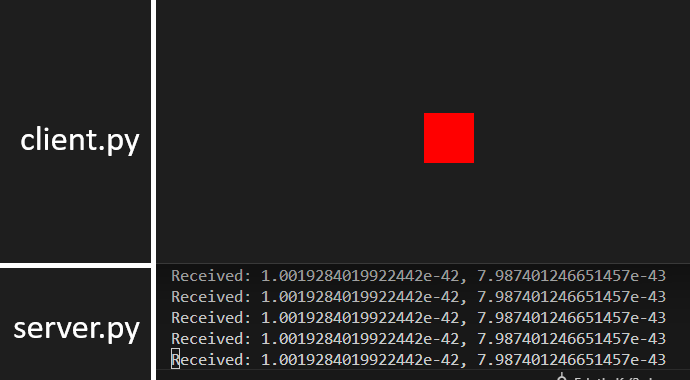
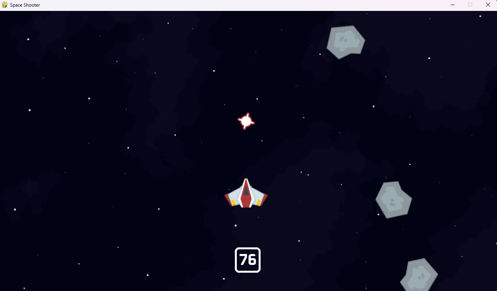

# py-beehive
Exploring networking and game development in python using pygame-ce. 

# Projects:

## network

- basic client-server setup using Python sockets
- client sends position of a square, and server prints the coordinates
- formatted data for send/receive using struct
- added "concurrency" by running socket listeners on separate threads

## spaceshooter

- simple arcade-style shooter
- learned how to load/draw images, and work with surfaces, rects, sprites
- keyboard and mouse input, sound effects, basic collision, simple animations
- experimented with basic multiplayer using ideas from [/network](#network)
  - implemented synced 2-player spaceship movement across network, but removed it when adding other features 
- assets from https://github.com/clear-code-projects/5games
